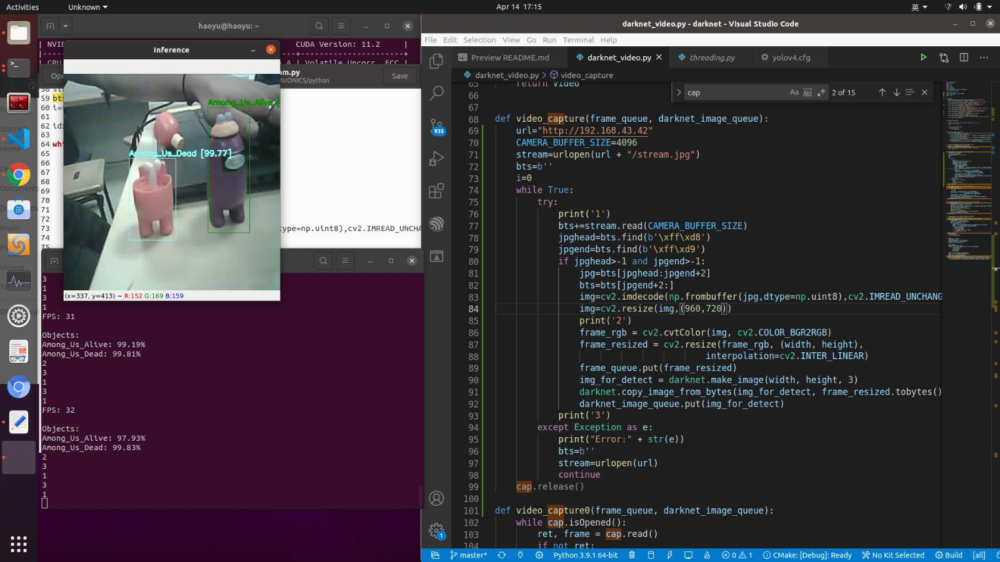

# Detection Scripts for ESP-Drone

Special Thanks to Nelsen and Andrian!

Here 4 scripts are shown, each is for different model/framework that is used or with different function call to organize the input/output.

Each script takes a url as the input, which is broadcasted by the ESP-drone. Details will be given below.

Auther: Wang Haoyu

Email: hy.wang00@gmail.com


## Mediapipe

Official Website: https://google.github.io/mediapipe/

Our Output Sample Screenshot (camera not connected well): 
<p align="center"></p>

Script: get_stream.py

Note: As an example, I used hand key-point detection. There are also other ready-to-use solutions like body key-point detection.

## Darknet

Official Repo: https://github.com/AlexeyAB/darknet

Our Training Script in Colab(from Kenny): https://colab.research.google.com/drive/1zmeSTP3J5zu2d5fHgsQC06DyYEYJFXq1?usp=sharing

Our Output Sample Screenshot: 
<p align="center"></p>

Script: ```darnet_video.py```

Note: Here we used our own .weights file and .cfg files, which are trained for detecting the figurines. There are only two classes, alive and dead. SSD(single-shot detection) is used if i am not wrong.

## Deepsort with yolov4

Official Repo: https://github.com/theAIGuysCode/yolov4-deepsort

Our minimized Repo(from Kenny): https://github.com/desmondkz/yolov4-deepsort

Our Training Script in Colab(from Kenny): https://colab.research.google.com/drive/1zmeSTP3J5zu2d5fHgsQC06DyYEYJFXq1?usp=sharing

Our Output Sample Screenshot: 

With Webcam
<p align="center"></p>

With ESP-cam
<p align="center"></p>


Script: ```object_tracker_lock.py```

Note No.1: To integrate the original python demo script with our streaming input, I met problems ```http.incompleteRead``` which I only manage to solve by putting the ```strem.read``` method into a ```threading.Thread``` object. And it works with lags. A lot of troubleshooting methods are tested but none worked. So I come up with the other idea.

Script: ```object_tracker.py```

Note No.2: With the problem mention above, and inspired by the script ```darknet_video.py```, I tried to make each function, namely ```get_stream(argvs)```, ```do_inference(argvs)``` and ```display(argvs)```, as ```threading.Thread``` objects, and call them inside the ```main()``` function. However, this gives the error about tensorflow's resource not got from localhost. With a first-step search, I learn that ```tf``` has its own ```Threading``` and ```Queues``` which might suggest that itself is not compatible with python's ```threading``` library. As the problem is not solved yet, this script cannot run. 
